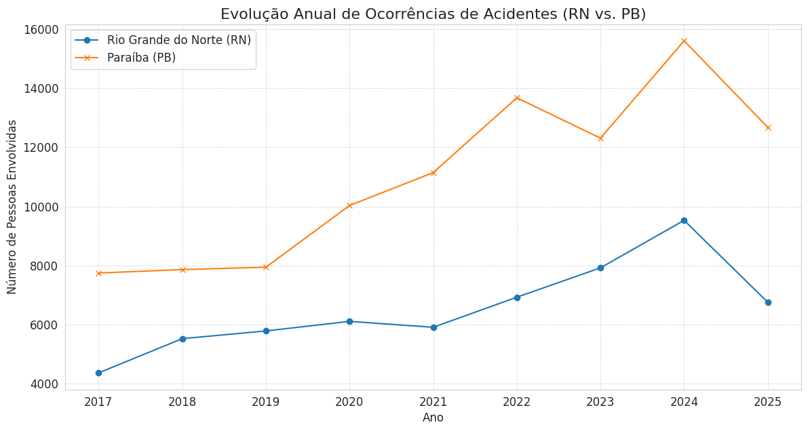
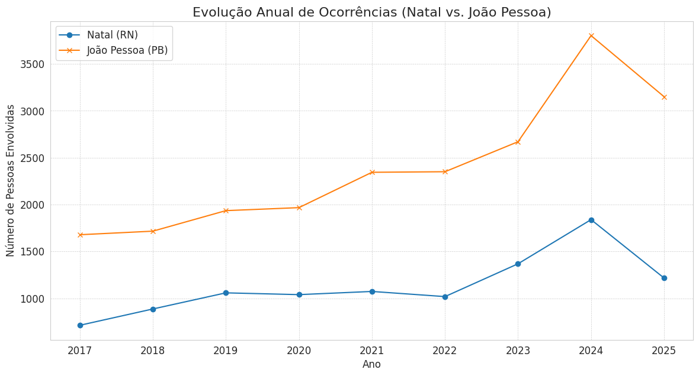
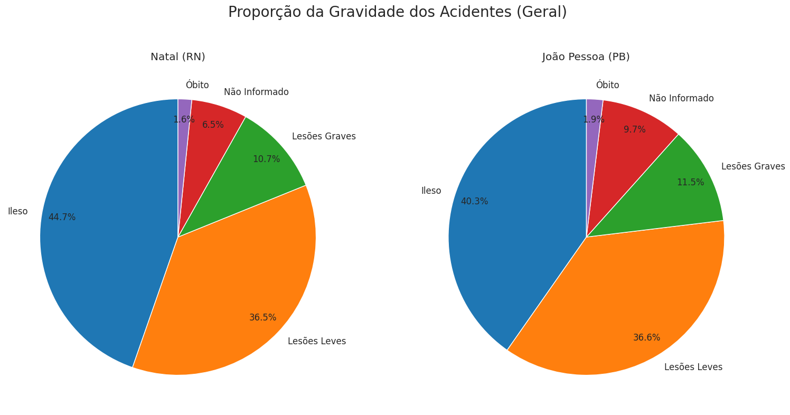
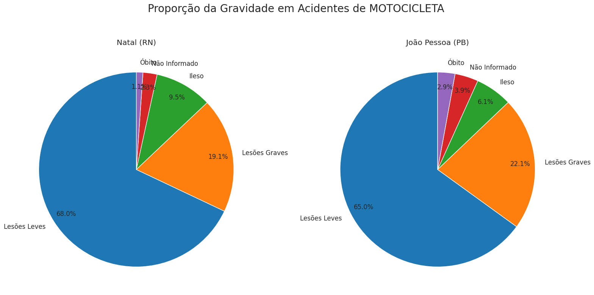

# Análise de Acidentes (PRF): RN vs. PB (2017-2025)

Análise Exploratória de Dados (EDA) sobre acidentes da PRF (2017-2025) com foco comparativo entre Natal (RN) e João Pessoa (PB).

**Notebook Interativo (Kaggle):** [Clique aqui para acessar o Notebook](https://www.kaggle.com/code/jadsonchagas/analise-acidentes-prf-rn-pb)

---

### 1. Visão Geral do Projeto

Este projeto é uma análise de ponta a ponta dos registros de acidentes de trânsito da Polícia Rodoviária Federal, cobrindo um período de 9 anos (2017-2025). O objetivo foi comparar o perfil dos acidentes nos estados do Rio Grande do Norte e Paraíba, com foco específico nas rodovias federais que atravessam as capitais Natal e João Pessoa.

A análise investiga tendências temporais, causas, tipos de veículos e a gravidade das ocorrências para identificar padrões e fatores de risco.

### 2. Principais Descobertas (Insights)

A análise revelou padrões claros, com destaque para o impacto desproporcional dos acidentes com motocicletas:

* **Tendência Temporal:** O volume de pessoas envolvidas em acidentes nas rodovias de João Pessoa é consistentemente maior que em Natal.
* **Causas Principais:** As causas mais comuns em ambas as capitais são relacionadas à falha humana, como "Falta de Atenção à Condução" e "Não manter distância".
* **O Risco da Motocicleta (Hipótese Confirmada):**
    * "Motocicleta" é o veículo com o maior número de envolvidos em acidentes em ambas as capitais, superando "Automóvel".
    * Isso explica por que "Queda de ocupante" e "Tombamento" são os tipos de acidente mais frequentes.
    * A chance de um motociclista sair **ileso** de um acidente é mínima (**6,1% em JP**, **9,5% em Natal**), em comparação com acidentes gerais (~45%).
* **O Custo Humano:** Os acidentes com motos são o principal motor das estatísticas de gravidade:
    * Em **João Pessoa**, **78,3%** de todas as "Lesões Graves" e **60,5%** de todos os "Óbitos" envolveram motocicletas.
    * Em **Natal**, **70,5%** de todas as "Lesões Graves" vieram de acidentes com motos.

### 3. Visualizações Principais

| Evolução por Estado | Evolução por Capital |
| :---: | :---: |
|  |  |

| Gravidade Geral | Gravidade (Apenas Motos) |
| :---: | :---: |
|  |  |

## 4. Ferramentas Utilizadas

* **Linguagem:** Python
* **Bibliotecas de Análise:** Pandas, KaggleHub
* **Bibliotecas de Visualização:** Matplotlib, Seaborn
* **Ambiente:** Jupyter Notebook (para ETL) e Kaggle Notebooks (para Análise)

## 5. Como Executar este Projeto

1.  **Clone este repositório:**
    ```sh
    git clone [https://github.com/seu-usuario/analise-acidentes-prf-rn-pb.git](https://github.com/seu-usuario/analise-acidentes-prf-rn-pb.git)
    ```
2.  **Baixe os Dados Processados:**
    Os arquivos CSV consolidados (2017-2025) são maiores que o limite do GitHub e estão hospedados publicamente no Kaggle.
    * **Faça o download dos 4 arquivos CSV** a partir deste Kaggle Dataset:
      **[Link para seu Kaggle Dataset (o link que você me enviou)]**
    * Crie uma pasta `data/processed/` dentro do repositório clonado.
    * Mova os 4 arquivos CSV para dentro da pasta `data/processed/`.

3.  **Crie o Ambiente:**
    ```sh
    pip install -r requirements.txt
    ```
4.  **Execute a Análise:**
    Abra o notebook `analise_acidentes_kaggle.ipynb` (ou o `acidentes_2025_2017.ipynb`) em um ambiente Jupyter.

## 6. Estrutura do Repositório

```text
/analise-acidentes-prf-rn-pb/
│
├── data/
│   └── processed/
│       └── (Esta pasta deve conter os 4 CSVs baixados do Kaggle)
│
├── img/
│   └── (Imagens e gráficos usados no README)
│
├── analise_acidentes_kaggle.ipynb     (Notebook principal de Análise/EDA)
├── acidentes_2025_2017.ipynb          (Notebook original de Processamento/ETL)
├── requirements.txt                   (Bibliotecas Python necessárias)
└── README.md                          (Esta documentação)
```

## 7. Fonte dos Dados

Os dados brutos foram obtidos no Portal de Dados Abertos da Polícia Rodoviária Federal (PRF).
